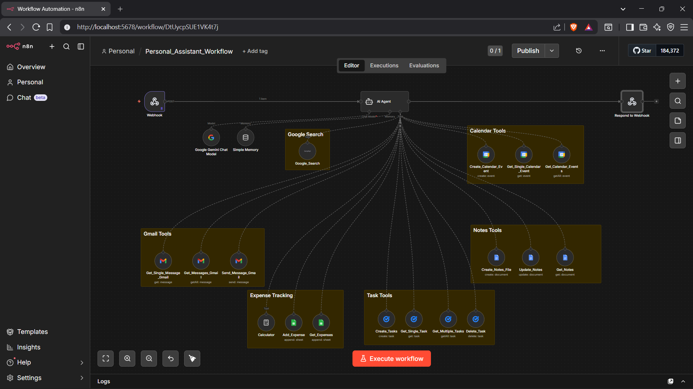

# 🧠 Personal Assistant Workflow – n8n

An advanced **AI-powered Personal Assistant Workflow** built using **n8n**, integrating multiple tools like Gmail, Google Calendar, Notes, Tasks, and Google Search into a single automated system.

This workflow uses an **AI Agent** to intelligently route user requests and perform actions across different services.

---

## 🚀 Overview

This project demonstrates how to build a **centralized automation system** where one AI agent controls multiple tools:

* 📧 Gmail automation
* 📅 Calendar management
* 📝 Notes handling
* ✅ Task tracking
* 💰 Expense tracking
* 🔍 Google Search integration

The system is triggered via a **Webhook**, processed by the AI Agent, and returns responses dynamically.

---

## 🧩 Workflow Architecture

  

---

## ⚙️ How It Works

1. **Webhook Trigger**
   Receives incoming requests from external apps or APIs.

2. **AI Agent**

   * Uses memory for context-aware responses
   * Decides which tool to use based on user input

3. **Tool Integrations**

   * **Gmail Tools** → Send, fetch, and manage emails
   * **Calendar Tools** → Create and retrieve events
   * **Notes Tools** → Manage documents/notes
   * **Task Tools** → Create, update, delete tasks
   * **Expense Tracking** → Log and calculate expenses
   * **Google Search** → Fetch real-time information

4. **Response Node**
   Sends processed output back to the user.

---

## ✨ Features

* 🤖 AI-driven decision making
* 🔗 Multi-tool integration in a single workflow
* 🧠 Context-aware memory system
* ⚡ Real-time automation using webhooks
* 📊 Scalable modular architecture

---

## 🛠️ Tech Stack

* **n8n** – Workflow automation
* **AI Agent** – Intelligent routing
* **Google APIs** – Gmail, Calendar
* **Custom Tools** – Tasks, Notes, Expenses

---

## 📌 Use Cases

* Personal productivity assistant
* Email and schedule automation
* Task and note management
* AI-powered daily operations
